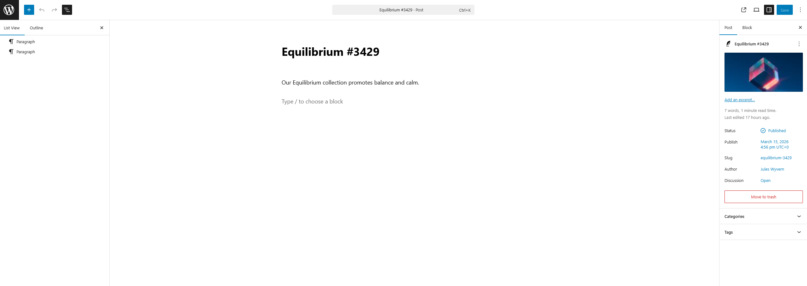
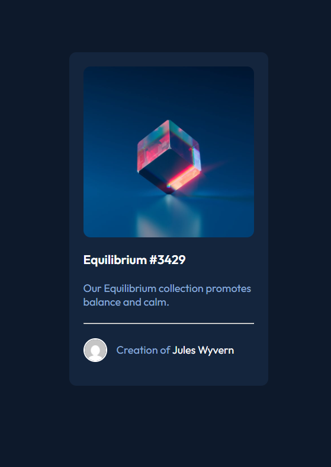

# NFT-preview-card-component-WP

I previously completed the Preview Card Component challenge from Frontend Mentor. 
In this project, I wanted to recreate the same component in WordPress. My goals were:
- Recreate the same visual design
- Use dynamic data instead of static content
- Custom styling with CSS

## The Frontend-Mentor challenge preview

## My solution
This is my solution on the WordPress editor side:

This is my solution on the final web page:

## Technologies
- WordPress
- HTML
- CSS
- PHP (WordPress template logic)

## Next steps
Next, I want to implement this component as a custom WordPress block. In a real website, there would likely be multiple cards displayed next to each other, so turning it into a reusable block would make it more flexible and practical.